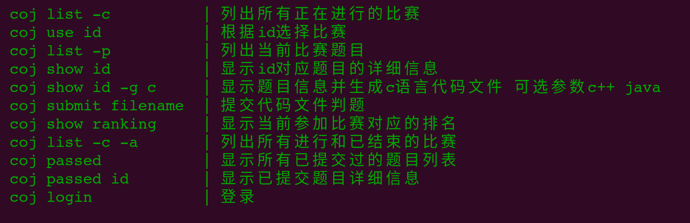

# 校oj题

[点击即可带来丝滑编程体验](https://github.com/ctguggbond/ctguOj-cli)

## [编程训练题目](problem)

## [2019校赛题目](schoolTest)
- [2019春校赛--求索溪边的树](schoolTest/1523.2019春校赛--求索溪边的树.cpp)

- [2019春校赛--求索溪边的徘徊](schoolTest/1524.2019春校赛--求索溪边的徘徊.cpp)

- [2019春校赛--求索溪边的树枝](schoolTest/1526.2019春校赛--求索溪边的树枝.cpp)

- [2019春校赛--求索溪边的教工食堂](schoolTest/1527.2019春校赛--求索溪边的教工食堂.cpp)
            
- [2019春校赛--求索溪边树上的鸟](schoolTest/1528.2019春校赛--求索溪边树上的鸟.cpp)

- [2019春校赛--求索溪边树下的小瓜](schoolTest/1531.2019春校赛--求索溪边树下的小瓜.cpp)
                  
- [2019春校赛--求索溪边的砖](schoolTest/1532.2019春校赛--求索溪边的砖.cpp)
           
