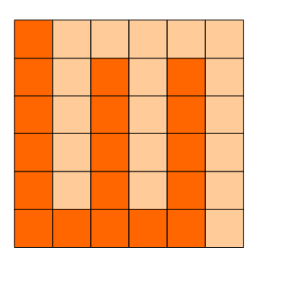
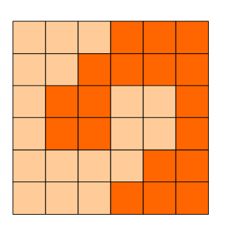

# 第八届蓝桥杯真题解题报告

<span id = "0">目录：</span>
1. [购物单](#1)
2. [等差素数列](#2)
3. [承压计算](#3)
4. [方格分割](#4)
5. [取数位](#5)
6. [最大公共子串](#6)
7. [日期问题](#7)
8. [包子凑数](#8)
9. [分巧克力](#9)
10. [k倍区间](#10)

[<span id = "1">1. 购物单</span>](#0)

    小明刚刚找到工作，老板人很好，只是老板夫人很爱购物。老板忙的时候经常让小明帮忙到商场代为购物。小明很厌烦，但又不好推辞。

    这不，XX大促销又来了！老板夫人开出了长长的购物单，都是有打折优惠的。
    小明也有个怪癖，不到万不得已，从不刷卡，直接现金搞定。
    现在小明很心烦，请你帮他计算一下，需要从取款机上取多少现金，才能搞定这次购物。

    取款机只能提供100元面额的纸币。小明想尽可能少取些现金，够用就行了。
    你的任务是计算出，小明最少需要取多少现金。

以下是让人头疼的购物单，为了保护隐私，物品名称被隐藏了。
```
-----------------
****     180.90       88折
****      10.25       65折
****      56.14        9折
****     104.65        9折
****     100.30       88折
****     297.15        半价
****      26.75       65折
****     130.62        半价
****     240.28       58折
****     270.62        8折
****     115.87       88折
****     247.34       95折
****      73.21        9折
****     101.00        半价
****      79.54        半价
****     278.44        7折
****     199.26        半价
****      12.97        9折
****     166.30       78折
****     125.50       58折
****      84.98        9折
****     113.35       68折
****     166.57        半价
****      42.56        9折
****      81.90       95折
****     131.78        8折
****     255.89       78折
****     109.17        9折
****     146.69       68折
****     139.33       65折
****     141.16       78折
****     154.74        8折
****      59.42        8折
****      85.44       68折
****     293.70       88折
****     261.79       65折
****      11.30       88折
****     268.27       58折
****     128.29       88折
****     251.03        8折
****     208.39       75折
****     128.88       75折
****      62.06        9折
****     225.87       75折
****      12.89       75折
****      34.28       75折
****      62.16       58折
****     129.12        半价
****     218.37        半价
****     289.69        8折
--------------------
```

需要说明的是，88折指的是按标价的88%计算，而8折是按80%计算，余者类推。
特别地，半价是按50%计算。
请提交小明要从取款机上提取的金额，单位是元。
答案是一个整数，类似4300的样子，结尾必然是00，不要填写任何多余的内容。

特别提醒：不许携带计算器入场，也不能打开手机。

解：
思路：这题直接代码解决，先将数据处理一下，去除\*\*\*\*和'折'字, 然后直接作为数据输入

[Excel解决办法](https://www.cnblogs.com/ljmzzyk/p/6918364.html)

```cpp
#include <iostream>
using namespace std;

int main(){
	double value, sum = 0;
	int discount;
	while(cin >> value && value != -1){   //输入-1结束
		cin >> discount;
		if(discount % 10 == 0)    //如果是8折、9折就换成80、90,便于后面计算
			discount *= 10;
		sum += value * discount / 100;  //每一次折扣后的费用都加起来
	}
	int a = sum / 100;   //取出整百部分
	if(sum - a * 100 > 0)    //如果费用不是整百，那么a + 1，表示将整百部分+1, 4301=>4400
		cout << (a + 1) * 100 << endl;
	else 
		cout << a * 100 << endl;
	return 0;
}
```
答案：9700
---

[<span id = "2">2. 等差素数列</span>](#0)

2,3,5,7,11,13,....是素数序列。
类似：7,37,67,97,127,157 这样完全由素数组成的等差数列，叫等差素数数列。
上边的数列公差为30，长度为6。
2004年，格林与华人陶哲轩合作证明了：存在任意长度的素数等差数列。
这是数论领域一项惊人的成果！
有这一理论为基础，请你借助手中的计算机，满怀信心地搜索：
长度为10的等差素数列，其公差最小值是多少？
注意：需要提交的是一个整数，不要填写任何多余的内容和说明文字。

解：
思路：暴力枚举每一个素数，每次得到一个素数，就从1-1000循环公差, 如果在该公差下的十个数都是素数，那么最小值就是该公差

```cpp
#include <iostream>
#include <cstring>
#include <cmath>
using namespace std;

bool sushu(int n){    //求素数
	for(int i = 2; i <= sqrt(n); i++){
		if(n % i == 0)
			return false;
	}
	return true;
}

int main(){
	int a;
	for(int i = 2; i < 100000; i++){
		if(sushu(i)){   //如果该数是素数
			for(int j = 2; j < 1000; j += 2){  //素数的公差不可能为奇数，因为除2外的素数都是奇数，奇数+奇数=偶数
				int p;
				for(p = 0; p < 10; p++)   //在公差为j的情况下，遍历后面的10个数
					if(!sushu(i + j * p))   //如果某一个不是素数，则跳出循环
						break;
				if(p == 10){       //10个数为素数，输出
					cout << j << endl;
				}
			}
		}
	}
	return 0;
}
```

答案：210
---

[<span id = "3">3. 承压计算</span>](#0)

X星球的高科技实验室中整齐地堆放着某批珍贵金属原料。
每块金属原料的外形、尺寸完全一致，但重量不同。
金属材料被严格地堆放成金字塔形。
```
                             7 
                            5 8 
                           7 8 8 
                          9 2 7 2 
                         8 1 4 9 1 
                        8 1 8 8 4 1 
                       7 9 6 1 4 5 4 
                      5 6 5 5 6 9 5 6 
                     5 5 4 7 9 3 5 5 1 
                    7 5 7 9 7 4 7 3 3 1 
                   4 6 4 5 5 8 8 3 2 4 3 
                  1 1 3 3 1 6 6 5 5 4 4 2 
                 9 9 9 2 1 9 1 9 2 9 5 7 9 
                4 3 3 7 7 9 3 6 1 3 8 8 3 7 
               3 6 8 1 5 3 9 5 8 3 8 1 8 3 3 
              8 3 2 3 3 5 5 8 5 4 2 8 6 7 6 9 
             8 1 8 1 8 4 6 2 2 1 7 9 4 2 3 3 4 
            2 8 4 2 2 9 9 2 8 3 4 9 6 3 9 4 6 9 
           7 9 7 4 9 7 6 6 2 8 9 4 1 8 1 7 2 1 6 
          9 2 8 6 4 2 7 9 5 4 1 2 5 1 7 3 9 8 3 3 
         5 2 1 6 7 9 3 2 8 9 5 5 6 6 6 2 1 8 7 9 9 
        6 7 1 8 8 7 5 3 6 5 4 7 3 4 6 7 8 1 3 2 7 4 
       2 2 6 3 5 3 4 9 2 4 5 7 6 6 3 2 7 2 4 8 5 5 4 
      7 4 4 5 8 3 3 8 1 8 6 3 2 1 6 2 6 4 6 3 8 2 9 6 
     1 2 4 1 3 3 5 3 4 9 6 3 8 6 5 9 1 5 3 2 6 8 8 5 3 
    2 2 7 9 3 3 2 8 6 9 8 4 4 9 5 8 2 6 3 4 8 4 9 3 8 8 
   7 7 7 9 7 5 2 7 9 2 5 1 9 2 6 5 3 9 3 5 7 3 5 4 2 8 9 
  7 7 6 6 8 7 5 5 8 2 4 7 7 4 7 2 6 9 2 1 8 2 9 8 5 7 3 6 
 5 9 4 5 5 7 5 5 6 3 5 3 9 5 8 9 5 4 1 2 6 1 4 3 5 3 2 4 1 
X X X X X X X X X X X X X X X X X X X X X X X X X X X X X X 
```
其中的数字代表金属块的重量（计量单位较大）。
最下一层的X代表30台极高精度的电子秤。

假设每块原料的重量都十分精确地平均落在下方的两个金属块上，
最后，所有的金属块的重量都严格精确地平分落在最底层的电子秤上。
电子秤的计量单位很小，所以显示的数字很大。
工作人员发现，其中读数最小的电子秤的示数为：2086458231
请你推算出：读数最大的电子秤的示数为多少？
注意：需要提交的是一个整数，不要填写任何多余的内容。

解：
思路：上面一个数字平均分到它下面的两个数字上，直接用二维数组存下所有数字，然后每一行的数字等于当前的数字加上它上面两个数字的一半
例如：
```
  1         1
 2 3    =>  2 3 
4 5 6       4 5 6
```
当上面的重量落下来的时候，第二行的2就变为2 + 1 / 2 = 2.5, 第三行的4就变为4 + 2.5 / 2
一直算到最后一行，取出最大和最小的两个数，那么读数最大的示数应为MAX * 2086458231 / MIN

```cpp
#include <iostream>
#include <cstring>
using namespace std;

int main(){
	double a[31][31];
	memset(a, 0, sizeof(a));
	for(int i = 1; i <= 29; i++)
		for(int j = 1;j <= i; j++)
			cin >> a[i][j];
	for(int i = 2; i <= 29; i++)
		for(int j = 1; j <= 29; j++){
			a[i][j] += a[i - 1][j - 1] / 2 + a[i - 1][j] / 2;   //下面一个数=正上的左边一个数/2+正上面的数/2
		}
	double MIN = 9999999, MAX = 0; 
	for(int i = 1; i <= 30; i++){
		a[30][i] = a[29][i - 1] / 2 + a[29][i] / 2;   //求出第30行的X的数字
		MIN = min(MIN, a[30][i]);    //求出最小值
		MAX = max(MAX, a[30][i]);    //求出最大值
	}
	cout << fixed << MAX * 2086458231 / MIN << endl;   //fixed格式化输出，使其以小数形式输出
	return 0;
}
```

答案：72665192664
---

[<span id = "4">4. 方格分割</span>](#0)

6x6的方格，沿着格子的边线剪开成两部分。
要求这两部分的形状完全相同。

如图：   就是可行的分割法。

试计算：
包括这3种分法在内，一共有多少种不同的分割方法。
注意：旋转对称的属于同一种分割法。

请提交该整数，不要填写任何多余的内容或说明文字。

解：
思路：由于剪开的两部分要完全相同，此时其一定关于中心对称，我们可以从(3, 3)开始出发，进行dfs遍历，由于dfs是连续找点的，所以找的格子一定是连在一起的，这就保证了可以分成两部分，在dfs遍历的时候同时对其对称的点作标记，这样旋转之后两部分就完全相同，因为旋转对称属于同一种，最终除以4，就是结果。

dfs讲解：https://www.cnblogs.com/OctoptusLian/p/7429645.html

```cpp
#include <iostream>
#include <cstring>
using namespace std;

const int N = 6;
int ans = 0;                    //存储方式
int map[N + 1][N + 1];          //存储走过的格子
int d[4][2] = {                 //定义行走方式
	            0, 1, 
            	1, 0,
             	0, -1,
             	-1, 0
               };

int dfs(int x, int y){
	if(x == 0 || y == 0 || x == N || y == N){    //到达边界返回
		ans++;
		return 0;
	}
	for(int i = 0; i < 4; i++){
		int tx = x + d[i][0];
		int ty = y + d[i][1];
		if(map[tx][ty]) continue;   //如果已经走过，那么换一条路
		map[tx][ty] = 1;           //没走过，标记1
		map[N - tx][N - ty] = 1;   //对称的格子标记1
		dfs(tx, ty);               //dfs继续遍历
		map[tx][ty] = 0;           //对路径进行还原
		map[N - tx][N - ty] = 0;
	}
}

int main(){
	map[N / 2][N / 2] = 1;   //先从(3, 3)点开始走，先标记为1
	dfs(N / 2, N / 2);
	cout << ans / 4 << endl;    //除以重复的情况
	return 0;
}
```

[<span id = "5">5. 取数位</span>](#0)

求1个整数的第k位数字有很多种方法。
以下的方法就是一种。

```
// 求x用10进制表示时的数位长度 
int len(int x){
	if(x<10) return 1;
	return len(x/10)+1;
}
	
// 取x的第k位数字
int f(int x, int k){
	if(len(x)-k==0) return x%10;
	return _____________________;  //填空
}
	
int main()
{
	int x = 23574;
	printf("%d\n", f(x,3));
	return 0;
}
```

对于题目中的测试数据，应该打印5。
请仔细分析源码，并补充划线部分所缺少的代码。
注意：只提交缺失的代码，不要填写任何已有内容或说明性的文字。

解：
思路：观察代码，len()函数明显是求x的长度，题目中23574的长度为5，f()函数就是求第k位数字，第一个if就是当x的长度和k相等时，返回x % 10, 如果x = 574, k = 3, 那么第k为数字就为x % 10 = 4，这里不满足if的话，就直接return了，可以看出，这是一个递归函数，将x的长度不断减小，最终只剩下k位，最终取模即可，空格处应该填f(x / 10, k)

答案：f(x / 10, k)
---

[<span id = "6">6. 最大公共子串</span>](#0)

最大公共子串长度问题就是：
求两个串的所有子串中能够匹配上的最大长度是多少。
比如："abcdkkk" 和 "baabcdadabc"，
可以找到的最长的公共子串是"abcd",所以最大公共子串长度为4。
下面的程序是采用矩阵法进行求解的，这对串的规模不大的情况还是比较有效的解法。
请分析该解法的思路，并补全划线部分缺失的代码。

```cpp
#include <stdio.h>
#include <string.h>

#define N 256
int f(const char* s1, const char* s2)
{
	int a[N][N];
	int len1 = strlen(s1);
	int len2 = strlen(s2);
	int i,j;

	memset(a,0,sizeof(int)*N*N);
	int max = 0;
	for(i=1; i<=len1; i++){
		for(j=1; j<=len2; j++){
			if(s1[i-1]==s2[j-1]) {
				a[i][j] = __________________________;  //填空
				if(a[i][j] > max) max = a[i][j];
			}
		}
	}
	return max;
}

int main()
{
	printf("%d\n", f("abcdkkk", "baabcdadabc"));
	return 0;
}
```
注意：只提交缺少的代码，不要提交已有的代码和符号。也不要提交说明性文字。

解：
思路：观察代码，两个循环+一个if，循环将s1中的每一个字母和s2中的每一个字母进行比较，s1中的第i个字符和s2中的字符相等，那么就将当前的这一次相等+它前面字符相等个数，由于每行都存储的是相等的字符个数，那么 它前面字符相等个数=a[i - 1][j - 1]
```
a b c d k k k
b a a b c d a d a b c
第一次比较a：
0 1 1 0 0 0 1 0 1 0 0
第二次比较b：
1 1 1 2 0 0 1 0 1 2 0
第三次比较c：
1 1 1 2 3 0 1 0 1 2 3
第三次比较d：
1 1 1 2 3 4 1 1 1 2 3
然后比较k...
```
答案：a[i][j] + a[i - 1][j - 1] + 1

[<span id = "7">7. 日期问题</span>](#0)

小明正在整理一批历史文献。这些历史文献中出现了很多日期。小明知道这些日期都在1960年1月1日至2059年12月31日。令小明头疼的是，这些日期采用的格式非常不统一，有采用年/月/日的，有采用月/日/年的，还有采用日/月/年的。更加麻烦的是，年份也都省略了前两位，使得文献上的一个日期，存在很多可能的日期与其对应。

比如02/03/04，可能是2002年03月04日、2004年02月03日或2004年03月02日。

给出一个文献上的日期，你能帮助小明判断有哪些可能的日期对其对应吗？

输入
----
一个日期，格式是"AA/BB/CC"。  (0 <= A, B, C <= 9)

输入
----
输出若干个不相同的日期，每个日期一行，格式是"yyyy-MM-dd"。多个日期按从早到晚排列。

样例输入
----
02/03/04

样例输出
----
2002-03-04
2004-02-03
2004-03-02

资源约定：
峰值内存消耗（含虚拟机） < 256M
CPU消耗  < 1000ms

解：
思路：首先将输入的字符串转化为年月日的数字，然后用数组存储下题意中的三种排列，对每个情况进行判断，首先年份要在1960 ~ 2059之间，月份在1 ~ 12之间，天数在1 ~ 31之间，注意闰年的2月是29天，4,6,9,11是30天，输出的时候注意前导0，比如2要输出02，这里需要注意去重的问题，如果是输入02/02/02，那么输出为2002-02-02，但是这个情况对于三种排列都满足

```cpp
#include <iostream>
#include <iomanip>
#include <algorithm>
using namespace std;

struct Day{
	int year;
	int month;
	int day;
};

bool judge(int year, int month, int day){
	if(year < 1960 || year > 2059 || month >= 13 || day > 31)
		return false;
	if(year % 4 == 0 && year % 100 != 0 || year % 400 == 0){  //闰年的情况
		if(month == 2 && day > 29)
			return false;
	}
	switch(month){   //对于每一个月，天数不同的情况
		case 2:
			if(day > 28)
				return false;
		case 4:
		case 6:
		case 9:
		case 11:
			if(day > 30)
				return false;
	}
	return true;
}

bool cmp(Day a, Day b){
	if(a.year == b.year){   //年份相等,则比较月份
		if(a.month == b.month)    //月份相等，则比较天数
			return a.day < b.day;
		return a.month < b.month;
	}
	return a.year < b.year;
}

int main(){
	string s;
	cin >> s;

	//提取出每个部分的数字
	int a = (s[0] - '0') * 10 + (s[1] - '0');
	int b = (s[3] - '0') * 10 + (s[4] - '0');
	int c = (s[6] - '0') * 10 + (s[7] - '0');
	int m[][3] = {
		a, b, c, 
		c, a, b,
		c, b, a};   //将三种情况存储在数组中
	Day d[100];
	int k = 0;
	for(int i = 0; i < 3; i++){
		int year = 1900 + m[i][0];   //年份有19和20两种
		int month = m[i][1];
		int day = m[i][2];
		if(judge(year, month, day)){   //如果满足，则加入进来
			d[k].year = year;
			d[k].month = month;
			d[k].day = day;
			k++;
		}

		year = 2000 + m[i][0];
		if(judge(year, month, day)){
			d[k].year = year;
			d[k].month = month;
			d[k].day = day;
			k++;
		}
	}
	sort(d, d + k, cmp);   //对日期进行排序
	for(int i = 0; i < k; i++){
		//去除和前一个日期重复的
		if(i != 0 && d[i].year == d[i - 1].year && d[i].month == d[i - 1].month && d[i].day == d[i - 1].day)
			continue;
		cout << d[i].year << "-";
		cout << setw(2) << setfill('0') << d[i].month << "-";
		cout << setw(2) << setfill('0') << d[i].day << endl;
	}
	return 0;
}
```

[<span id = "8">8. 包子凑数</span>](#0)

小明几乎每天早晨都会在一家包子铺吃早餐。他发现这家包子铺有N种蒸笼，其中第i种蒸笼恰好能放Ai个包子。每种蒸笼都有非常多笼，可以认为是无限笼。

每当有顾客想买X个包子，卖包子的大叔就会迅速选出若干笼包子来，使得这若干笼中恰好一共有X个包子。比如一共有3种蒸笼，分别能放3、4和5个包子。当顾客想买11个包子时，大叔就会选2笼3个的再加1笼5个的（也可能选出1笼3个的再加2笼4个的）。

当然有时包子大叔无论如何也凑不出顾客想买的数量。比如一共有3种蒸笼，分别能放4、5和6个包子。而顾客想买7个包子时，大叔就凑不出来了。

小明想知道一共有多少种数目是包子大叔凑不出来的。

输入
----
第一行包含一个整数N。(1 <= N <= 100)
以下N行每行包含一个整数Ai。(1 <= Ai <= 100)

输出
----
一个整数代表答案。如果凑不出的数目有无限多个，输出INF。

例如，
输入：
2
4
5

程序应该输出：
6

再例如，
输入：
2
4
6

程序应该输出：
INF

样例解释：
对于样例1，凑不出的数目包括：1, 2, 3, 6, 7, 11。
对于样例2，所有奇数都凑不出来，所以有无限多个。

资源约定：
峰值内存消耗（含虚拟机） < 256M
CPU消耗  < 1000ms

解：
思路：由裴蜀定理知：a * x + b * y = gcd(a, b), 令c = gcd(a, b), 则a * x + b * y = c, 说明如果想让ａ和ｂ来表示ｃ，那么ｃ一定为ａ和ｂ的最大公约数的倍数。
这样就有一个结论：如果数据中含有两个数的最大公约数为１，那么就可以表示１的倍数，除了前面凑不出来的数
有两个数４,６, 最大公约数为２, 只能表示２的倍数的数字,不能表示奇数
首先标记能表示的数，然后遍历没有被标记的，就是不能表示的数

```cpp
#include <iostream>
#include <cstring>
using namespace std;

const int N = 10001;

int gcd(int a, int b){
	return b == 0 ? a : gcd(b, a % b);
}

int main(){
	int n;
	cin >> n;
	int a[N];
	int b[N];
	memset(b, 0, sizeof(b));
	for(int i = 0; i < n; i++){
		 cin >> a[i];
	}
	int g = a[0];
	for(int i = 0; i < n; i++)
		g = gcd(g, a[i]);   //如果有两个数a, b，gcd(a, b) = 1, 则g = 1, 那么gcd(g, x) = 1;
	if(g != 1){    //如果最大公约数没有为１的，那么就有无限个数凑不出来
		cout << "INF" << endl;
		return 0;
	}
	else{
		b[0] = 1;   //0个包子，就取0笼
		for(int i = 0; i < n; i++)
			for(int j = 0; j + a[i] < N; j++)
				if(b[j])    //如果数字为ｊ的能凑，那么j + a[i]也能凑，即在ｊ的基础上+a[i]
					b[j + a[i]] = 1;
	}
	int sum = 0;
	for(int i = 0; i < N; i++)   //遍历Ｎ，看那些没有标记
		if(!b[i])
			sum++;
	cout << sum << endl;
	return 0;
}
```
---

[<span id = "9">9. 分巧克力</span>](#0)

儿童节那天有K位小朋友到小明家做客。小明拿出了珍藏的巧克力招待小朋友们。
小明一共有N块巧克力，其中第i块是Hi x Wi的方格组成的长方形。

为了公平起见，小明需要从这 N 块巧克力中切出K块巧克力分给小朋友们。切出的巧克力需要满足：

1.形状是正方形，边长是整数  
2.大小相同  

例如一块6x5的巧克力可以切出6块2x2的巧克力或者2块3x3的巧克力。

当然小朋友们都希望得到的巧克力尽可能大，你能帮小Hi计算出最大的边长是多少么？

输入
第一行包含两个整数N和K。(1 <= N, K <= 100000)  
以下N行每行包含两个整数Hi和Wi。(1 <= Hi, Wi <= 100000) 
输入保证每位小朋友至少能获得一块1x1的巧克力。   

输出
输出切出的正方形巧克力最大可能的边长。

样例输入：
2 10  
6 5  
5 6  

样例输出：
2

资源约定：
峰值内存消耗（含虚拟机） < 256M
CPU消耗  < 1000ms

解：
思路：这题采用二分法，首先找到最大的边长，作为二分操作中的right，对边长进行二分操作，即mid = (left + right) / 2，如果mid长度满足题意，那么继续增大mid，也就是让left = mid + 1.如何判断mid长度是否满足题意呢，循环遍历巧克力的边长，h / mid, w / mid 得到有多少mid长度的边，两者的乘积就是边长为mid的正方形的个数
例如：
```
 __ __ __
|        |   边长为3*3的矩形,假如mid = 2, 那么(3 / 2) * (3 / 2) = 1,可以形成一个2*2的正方形
|        |   相当于在ｈ上有n = h / mid 个mid, ｗ上有m = w / mid个mid, 总共有n * m 个 mid*mid
|__ __ __|

```

```cpp
#include <iostream>
using namespace std;

int n, k;
int h[100000], w[100000];
bool fun(int b){
	int sum = 0;
	for(int i = 0; i < n; i++){
		sum += (h[i] / b) * (w[i] / b);   //求出满足边长为mid的正方形的个数
		if(sum >= k)    //如果已经达到ｋ个了，就返回
			return true;
	}
	return false;
}

int main(){
	cin >> n >> k;
	int left = 0, right = 0;
	for(int i = 0; i < n; i++){
		cin >> h[i] >> w[i];
		right = max(right, h[i]);	//找出最大的那个边长
		right = max(right, w[i]);
	}
	while(left < right){
		int mid = (left + right) / 2;    //不断二分边长，直到left < right
		if(fun(mid))
			left = mid + 1;
		else
			right = mid - 1;
	}
	cout << left << endl;   //输出边长
	return 0;
}
```
---

[<span id = "10">10. k倍区间</span>](#0)

给定一个长度为N的数列，A1, A2, ... AN，如果其中一段连续的子序列Ai, Ai+1, ... Aj(i <= j)之和是K的倍数，我们就称这个区间[i, j]是K倍区间。

你能求出数列中总共有多少个K倍区间吗？

输入
-----
第一行包含两个整数N和K。(1 <= N, K <= 100000)
以下N行每行包含一个整数Ai。(1 <= Ai <= 100000)

输出
-----
输出一个整数，代表K倍区间的数目。


例如，
输入：
5 2
1
2
3
4
5

程序应该输出：
6

资源约定：
峰值内存消耗（含虚拟机） < 256M
CPU消耗  < 2000ms

解：
思路：首先对数组进行前缀和a[i] + a[i - 1], 那么区间[l, r]的和为a[r] - a[l - 1], 如果(a[r] - a[l - 1]) % k == 0, 那么这个区间就是一个ｋ倍区间
(a[r] - a[l - 1]) % k == 0
=> a[r] % k == a[l - 1] % k
可以看出如果区间两端点对ｋ的模相等，那么这个区间就是一个ｋ倍区间。我们可以在求前缀和的同时直接将这个对ｋ取模之后的数求出来，即a[r] % k, 只要有一个相等的情况我们就存储起来，这个数组记做b[],b数组的下标存储的就是a[r] % k, 对于进行了前缀和取模后的数组a, 只要将里面模数相等的个数全部存储在b数组中，那么对里面的端点进行两两组合，那么就可以得出这个区间[l, r], 组合数为C(n, 2) = n * (n - 1) / 2, 对于a[r] % k刚好为０的情况，只需要这一个端点就满足条件，所以要加上模数为０的总数

```cpp
#include <iostream>
#include <cstring>
using namespace std;

typedef long long ll;   //定义long long 避免爆数据

int main(){
	int n, k;
	cin >> n >> k;
	ll a[100001], b[100001];
	memset(a, 0, sizeof(a));  //初始化数组为０
	memset(b, 0, sizeof(b));
	for(int i = 1; i <= n; i++){
		cin >> a[i];
		a[i] = (a[i] + a[i - 1]) % k;   //a[i] + a[i - 1]为前缀和，这里同时取模，即a[r] % k
		b[a[i]]++;     //a[r] % k的个数，满足a[r] % k == a[l - 1] % k的区间[l, r]为k倍区间
	}
	ll sum = 0;
	for(int i = 0; i < k; i++){
		if(b[i]){   //如果含有点
			sum += b[i] * (b[i] - 1) / 2;   //组合求个数, 每两个点可以组成一个区间
		}
	}
	sum +=  b[0];   //如果模数为0, 表明区间为[0, r], 加上本身的情况
	cout << sum << endl;
	return 0;
}
```
