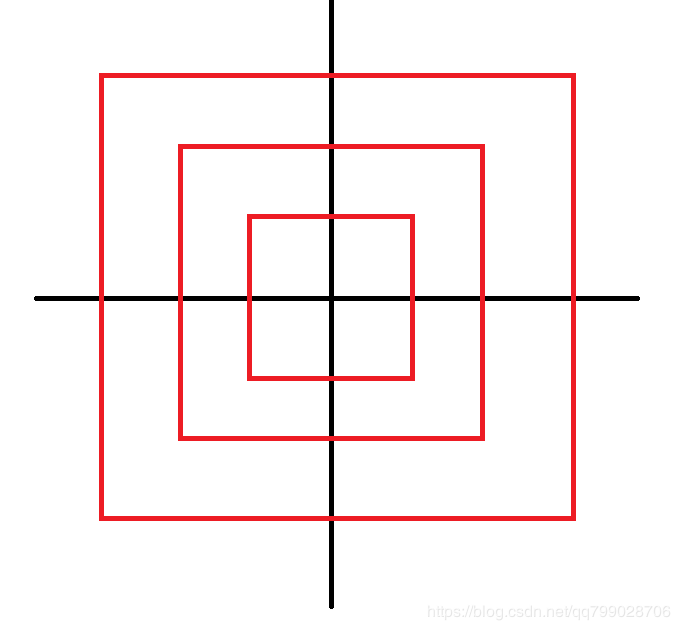

# 第九届蓝桥杯真题题解

<span id = "0">目录：</span>
1. [第几天](#1)
2. [明码](#2)
3. [乘积尾零](#3)
4. [测试次数](#4)
5. [快速排序](#5)
6. [递增三元组](#6)
7. [螺旋折线](#7)
8. [日志统计](#8)
9. [全球变暖](#9)
10. [乘积最大](#10)

[<span id = "1">1. 第几天</span>](#0) 

2000年的1月1日，是那一年的第1天。
那么，2000年的5月4日，是那一年的第几天？

**解：
思路：Excel解决: 2000/5/4 - 2000/1/1 + 1 = 125
1,3: 31天、2: 29天、4: 30天、5: 4天  => 31 * 2 + 29 + 30 + 4 = 125**

**答案: 125**

---

[<span id = "2">2.明码</span>](#0)

汉字的字形存在于字库中，即便在今天，16点阵的字库也仍然使用广泛。
16点阵的字库把每个汉字看成是16x16个像素信息。并把这些信息记录在字节中。

一个字节可以存储8位信息，用32个字节就可以存一个汉字的字形了。
把每个字节转为2进制表示，1表示墨迹，0表示底色。每行2个字节，
一共16行，布局是：

    第1字节，第2字节
    第3字节，第4字节
    ....
    第31字节, 第32字节

这道题目是给你一段多个汉字组成的信息，每个汉字用32个字节表示，这里给出了字节作为有符号整数的值。

题目的要求隐藏在这些信息中。你的任务是复原这些汉字的字形，从中看出题目的要求，并根据要求填写答案。

这段信息是（一共10个汉字）：
4 0 4 0 4 0 4 32 -1 -16 4 32 4 32 4 32 4 32 4 32 8 32 8 32 16 34 16 34 32 30 -64 0 
16 64 16 64 34 68 127 126 66 -124 67 4 66 4 66 -124 126 100 66 36 66 4 66 4 66 4 126 4 66 40 0 16 
4 0 4 0 4 0 4 32 -1 -16 4 32 4 32 4 32 4 32 4 32 8 32 8 32 16 34 16 34 32 30 -64 0 
0 -128 64 -128 48 -128 17 8 1 -4 2 8 8 80 16 64 32 64 -32 64 32 -96 32 -96 33 16 34 8 36 14 40 4 
4 0 3 0 1 0 0 4 -1 -2 4 0 4 16 7 -8 4 16 4 16 4 16 8 16 8 16 16 16 32 -96 64 64 
16 64 20 72 62 -4 73 32 5 16 1 0 63 -8 1 0 -1 -2 0 64 0 80 63 -8 8 64 4 64 1 64 0 -128 
0 16 63 -8 1 0 1 0 1 0 1 4 -1 -2 1 0 1 0 1 0 1 0 1 0 1 0 1 0 5 0 2 0 
2 0 2 0 7 -16 8 32 24 64 37 -128 2 -128 12 -128 113 -4 2 8 12 16 18 32 33 -64 1 0 14 0 112 0 
1 0 1 0 1 0 9 32 9 16 17 12 17 4 33 16 65 16 1 32 1 64 0 -128 1 0 2 0 12 0 112 0 
0 0 0 0 7 -16 24 24 48 12 56 12 0 56 0 -32 0 -64 0 -128 0 0 0 0 1 -128 3 -64 1 -128 0 0 

注意：需要提交的是一个整数，不要填写任何多余内容。

**解:
思路: 每行两个字节，每一个字节存储一个整数，可以先将整数转化为8位二进制，负数的二进制需要+2^n(这里n为8),然后用除k取余法求得整数对应的二进制，然后1输出 * , 0输出空格,每画完两个整数换行

最终输出为 九的九次方等于多少?**

代码1:
```cpp
#include <iostream>
#include <cmath>
#include <cstring>
using namespace std;

int fun(){
	int n;
	cin >> n;
	if(n < 0){   //负数的二进制原码为2^n + x
		n += pow(2, 8);
	}
	int a[8], k = 7;
	memset(a, 0, sizeof(a));
	while(n != 0){   //除k取余法,余数最终要倒过来
		a[k--] = n % 2;
		n /= 2;
	}
	for(int i = 0; i < 8; i++){   //输出图形
		if(a[i] == 1)
			cout << "*";
		else
			cout << " ";
	}
	return 0;
}

int main(){
	for(int i = 0; i < 10; i++)
		for(int j = 0; j < 16; j++){
			fun();   //两个整数为一行，就直接调用两次函数
			fun();
			cout << endl;
		}
	return 0;
}
```

代码2:
```cpp
#include <iostream>
#include <bitset>
#include <cstring>
using namespace std;

int fun(){
	cin >> n;
	bitset<8> b(n);   //创建一个数值为n的8位二进制数,从左到右是低位到高位
	for(int i = b.size() - 1; i >= 0; i--){
		if(b[i] == 0)    //直接下标访问
			cout << " ";
		else
			cout << "*";
	}
}

int main(){
	for(int i = 0; i < 10; i++)
		for(int j = 0; j < 16; j++){
			fun();
			fun();
			cout << endl;
		}
	return 0;
}
```
答案: 387420489

---

[<span id = "3">3. 乘积尾零</span>](#0) 

如下的10行数据，每行有10个整数，请你求出它们的乘积的末尾有多少个零？

5650 4542 3554 473 946 4114 3871 9073 90 4329 
2758 7949 6113 5659 5245 7432 3051 4434 6704 3594 
9937 1173 6866 3397 4759 7557 3070 2287 1453 9899 
1486 5722 3135 1170 4014 5510 5120 729 2880 9019 
2049 698 4582 4346 4427 646 9742 7340 1230 7683 
5693 7015 6887 7381 4172 4341 2909 2027 7355 5649 
6701 6645 1671 5978 2704 9926 295 3125 3878 6785 
2066 4247 4800 1578 6652 4616 1113 6205 3264 2915 
3966 5291 2904 1285 2193 1428 2265 8730 9436 7074 
689 5510 8243 6114 337 4096 8199 7313 3685 211 

注意：需要提交的是一个整数，表示末尾零的个数。不要填写任何多余内容。

**解：
思路：由于2 * 5 = 10,因此直接求出所有数中2和5的个数，取最小的那个数就是0的个数**

```cpp
#include <iostream>
#include <cmath>
using namespace std;

//求能整除的2的个数
int fun2(int n){
	int sum1 = 0;
	while(n % 2 == 0){   //不断除以2，直到该数不能被整除，求出的就是2的个数
		n /= 2;
		sum1++;
	}
	return sum1;
}

//求能整除的5的个数
int fun5(int n){
	int sum1 = 0;
	while(n % 5 == 0){
		n /= 5;
		sum1++;
	}
	return sum1;
}

int main(){
	int sum2 = 0, sum5 = 0;
	int n;
	for(int i = 0; i < 100; i++){
		cin >> n;
		sum2 += fun2(n);
		sum5 += fun5(n);
	}
	int m = min(sum2, sum5);    //2和5的个数中最小的那个就是10的个数,也就是末尾为0的个数
	cout << m << endl;
	return 0;
}
```

[<span id = "4">4. 测试次数</span>](#0)

x星球的居民脾气不太好，但好在他们生气的时候唯一的异常举动是：摔手机。
各大厂商也就纷纷推出各种耐摔型手机。x星球的质监局规定了手机必须经过耐摔测试，并且评定出一个耐摔指数来，之后才允许上市流通。

x星球有很多高耸入云的高塔，刚好可以用来做耐摔测试。塔的每一层高度都是一样的，与地球上稍有不同的是，他们的第一层不是地面，而是相当于我们的2楼。

如果手机从第7层扔下去没摔坏，但第8层摔坏了，则手机耐摔指数=7。
特别地，如果手机从第1层扔下去就坏了，则耐摔指数=0。
如果到了塔的最高层第n层扔没摔坏，则耐摔指数=n

为了减少测试次数，从每个厂家抽样3部手机参加测试。

某次测试的塔高为1000层，如果我们总是采用最佳策略，在最坏的运气下最多需要测试多少次才能确定手机的耐摔指数呢？

请填写这个最多测试次数。

注意：需要填写的是一个整数，不要填写任何多余内容。

**解:
思路: 这是一道动态规划的题，设dp[i][j]表示i部, 耐摔指数为j的手机的测试次数，经过k次测试能够得出手机的耐摔指数，可以写出状态转移方程dp[i][j] = max(dp[i - 1][k - 1], dp[i][j - k]) + 1。dp[i - 1][k - 1]表示第i部手机摔坏了，这个时候手机数目-1，测试次数k-1，需要从k-1层测试才能保证测出耐摔指数(k - 1次机会，测试1 ~ k - 1层必定测出)，dp[i][j - k]表示第i部手机没有摔坏，这个时候就要测试k + 1 ~ j层，可以转化为测试1 ~ j - k层(这里只是层数的区间和高度无关)，由于是最坏的运气下的测试次数，所以取前面两者的最大测试次数+1就是这一次测试的次数(如果不取最大，那么最坏情况不能满足, +1是因为要加上这一次的测试)，经过最佳策略得出的测试次数应该小于等于每一层都摔手机的这个最大次数, 即取min(dp[i][j], max(dp[i - 1][k - 1], dp[i][j - k]) + 1)**

[N个鸡蛋从M楼层摔](https://blog.csdn.net/wolinxuebin/article/details/47057707)

```cpp
#include <iostream>
#include <cstring>
using namespace std;

int main(){
	int phone = 3, house = 1000;  //3部手机，1000层楼
	int dp[5][1005];
	memset(dp, 0, sizeof(dp));
	for(int i = 1; i <= phone; i++){   //初始化dp为最坏的层数，也就是每一层都要试
		for(int j = 1;j <= house; j++){
			dp[i][j] = j;
		}
	}
	for(int i = 2; i <= phone; i++)
		for(int j = 1; j <= house; j++){   //i部手机在j层楼的摔坏指数
			for(int k = 1; k < j; k++)    //测试次数为k 
				//最优策略：1. 第i部手机摔坏, 假设前面已经求出摔坏指数，则摔坏指数为dp[i - 1][k - 1]; 2. 第i部手机没有摔坏，则摔坏指数为第i部手机在k + 1 ~ j中测试后得出的摔坏指数，k + 1 ~ j可以转化为1 ~ j - k, 即dp[i][j - k]
				dp[i][j] = min(dp[i][j], max(dp[i - 1][k - 1], dp[i][j - k]) + 1);
		}
	cout << dp[3][1000] << endl;  //由于是在层数增加的情况下在dp[i][j]得出测试次数k，那么无论层数多高，测试次数都是k,这里由于不知道j，取最高层就行
	return 0;
}
```
**答案: 19**

---

[<span id = "5">快速排序</span>](#0) 

以下代码可以从数组a[]中找出第k小的元素。
它使用了类似快速排序中的分治算法，期望时间复杂度是O(N)的。
请仔细阅读分析源码，填写划线部分缺失的内容。

```cpp
#include <stdio.h>

int quick_select(int a[], int l, int r, int k) {
	int p = rand() % (r - l + 1) + l;
	int x = a[p];
	{int t = a[p]; a[p] = a[r]; a[r] = t;}
	int i = l, j = r;
	while(i < j) {
		while(i < j && a[i] < x) i++;
		if(i < j) {
			a[j] = a[i];
			j--;
		}
		while(i < j && a[j] > x) j--;
		if(i < j) {
			a[i] = a[j];
			i++;
		}
	}
	a[i] = x;
	p = i;
	if(i - l + 1 == k) return a[i];
	if(i - l + 1 < k) return quick_select( _____________________________ ); //填空
	else return quick_select(a, l, i - 1, k);
}

int main()
{
	int a[] = {1, 4, 2, 8, 5, 7, 23, 58, 16, 27, 55, 13, 26, 24, 12};
	printf("%d\n", quick_select(a, 0, 14, 5));
	return 0;
}
```

**解:
思路:首先观察代码，rand() % m是随机产生0 ~ m - 1的随机数，l为左边数的下标，r为右边数的下标, r - l + 1是[l, r]这个区间的长度也就是从这个区间从取出一个数a[p]赋值给x, 这里有个{int t = a[p]; a[p] = a[r]; a[r] = t;}交换操作，是因为循环中有两个if，如果没有这个操作，那么赋值操作会覆盖数据，例如1 2 3 4, 假设x = 3, 当a[i] = 3时, 不满足a[i] < x跳出循环, 这个时候进入if，a[j] = 3, j--, 数组a中的数据为1 2 3 3, j = 3, 可以观察到数组中的4丢失了，所以预先把3放在最后就不会出现这种情况 => 1 2 4 3, 跳出循环时：1 2 4 4, 最后有个a[i] = x => 1 2 3 4**

**然后中间循环就是熟悉的快速排序的操作，将比x小的放在它左边，比x大的放在它右边，这样即使x左右两边的数是无序的，x也是第i - l + 1大，这样就比较i - l + 1这个下标和下标k的大小，如果相等，那么这个数就是第k小，如果小于k，那么就找[i + 1, r]区间内的第k - (i - l + 1)小(如果假设n = i - l + 1,a[n]是第n小，那么只要再往后找k - n个数，那么就找到了k => 1 2 n 4 5 k)，就是最终的结果，如果大于k,那么就找[l, i - 1]区间内的第k小**

**答案: a, i + 1, r, k - (i - l + 1)**

---

[<span id = "6">6. 递增三元组</span>](#0) 

给定三个整数数组
A = [A1, A2, ... AN],
B = [B1, B2, ... BN],
C = [C1, C2, ... CN]，
请你统计有多少个三元组(i, j, k) 满足：
1. 1 <= i, j, k <= N
2. Ai < Bj < Ck

【输入格式】
第一行包含一个整数N。
第二行包含N个整数A1, A2, ... AN。
第三行包含N个整数B1, B2, ... BN。
第四行包含N个整数C1, C2, ... CN。

对于30%的数据，1 <= N <= 100
对于60%的数据，1 <= N <= 1000
对于100%的数据，1 <= N <= 100000 0 <= Ai, Bi, Ci <= 100000

【输出格式】
一个整数表示答案

【样例输入】
3
1 1 1
2 2 2
3 3 3

【样例输出】
27

资源约定：
峰值内存消耗（含虚拟机） < 256M
CPU消耗  < 1000ms

**解:
思路: 先将三个数组中的数据排序，然后用查找a中有多少小于b的数，c中有多少大于b的数，然后求乘积就是b[i]情况下的组合数，最后将所有的组合数求和**
**这里可以用库函数upper__bound(a, a + n, k), (函数为二分查找, 效率logn), 表示从ａ数组中查询第一个大于k的数，并返回其地址，由于a是数组的首地址，我们用upper__bound(a, a + n, k) - a就可以求得小于b[i]的个数**

```cpp
#include <iostream>
#include <algorithm>
using namespace std;

typedef long long ll;

int main(){
	int n;
	cin >> n;
	int a[100001], b[100001], c[100001];
	for(int i = 0; i < n; i++)
		cin >> a[i];
	for(int i = 0; i < n; i++)
		cin >> b[i];
	for(int i = 0; i < n; i++)
		cin >> c[i];

	ll sum = 0;
	for(int i = 0; i < n; i++){
		ll s1 = upper_bound(a, a + n, b[i]) - a;   //求出a数组中小于b[i]的个数
		ll s2 = n - (upper_bound(c, c + n, b[i]) - c);   //求出c数组中大于b[i]的个数
		sum += s1 * s2;  //求组合情况数
	}
	cout << sum << endl;
	return 0;
}
```
---


[<span id = "7">螺旋折线</span>](#0) 

如图


所示的螺旋折线经过平面上所有整点恰好一次。  
对于整点(X, Y)，我们定义它到原点的距离dis(X, Y)是从原点到(X, Y)的螺旋折线段的长度。  

例如dis(0, 1)=3, dis(-2, -1)=9  

给出整点坐标(X, Y)，你能计算出dis(X, Y)吗？

【输入格式】
X和Y  

对于40%的数据，-1000 <= X, Y <= 1000  
对于70%的数据，-100000 <= X， Y <= 100000  
对于100%的数据, -1000000000 <= X, Y <= 1000000000  

【输出格式】
输出dis(X, Y)  

【样例输入】
0 1

【样例输出】
3

资源约定：
峰值内存消耗（含虚拟机） < 256M
CPU消耗  < 1000ms

**解:
思路: 先将左下角的一条边旋转90°，得到



将输入的x和y比较大小，将大的数n作为最外层正方形的边，起点为(-n, -n), 计算(x, y)和(-n, -n)的距离d1 = x - n, d2 = y - n, 当y > x时，点在左部和上部, 最外层的边数为d1 + d2 (也就是走过的边); 当y < x时，点在右部和下部，最外层的边数为总边数8 * n - (d1 + d2)  (也就是总边减去没有经过的边),内层边为8 * 1, 8 * 2, 8 * 3, 8 * 4... => 8 * (n * (n - 1) / 2) => 4 * n * (n - 1), 最后求和sum + d**

```cpp
#include <iostream>
using namespace std;

typedef long long ll;

int main(){
	ll x, y;
	cin >> x >> y;
	ll n = max(abs(x), abs(y));   //求最大的那个值，作为外层正方形的边
	ll sum = 4 * n * (n - 1);   //计算内层所有正方形的边长
	ll tx = -n, ty = -n;    //得到左下角的那个点
	ll d = 0, d1 = x - tx, d2 = y - ty;
	if(y > x)    //在y - x > 0的那一块，直接将x和y的相对距离相加
		d = d1 + d2;
	else   //在y - x <= 0的那一块，直接用总数减去没有走的边
		d = 8 * n - d1 - d2;
	cout << sum + d << endl;   //最后求和
	return 0;
}
```
---

[<span id = "8">8. 日志统计</span>](#0) 

小明维护着一个程序员论坛。现在他收集了一份"点赞"日志，日志共有N行。其中每一行的格式是：

ts id

表示在ts时刻编号id的帖子收到一个"赞"。

现在小明想统计有哪些帖子曾经是"热帖"。如果一个帖子曾在任意一个长度为D的时间段内收到不少于K个赞，小明就认为这个帖子曾是"热帖"。

具体来说，如果存在某个时刻T满足该帖在\[T ,T + D)这段时间内(注意是左闭右开区间)收到不少于K个赞，该帖就曾是"热帖"。

给定日志，请你帮助小明统计出所有曾是"热帖"的帖子编号。

【输入格式】
第一行包含三个整数N、D和K。
以下N行每行一条日志，包含两个整数ts和id。

对于50%的数据，1 <= K <= N <= 1000
对于100%的数据，1 <= K <= N <= 100000 0 <= ts <= 100000 0 <= id <= 100000

【输出格式】
按从小到大的顺序输出热帖id。每个id一行。

【输入样例】
7 10 2
0 1
0 10
10 10
10 1
9 1
100 3
100 3

【输出样例】
1
3

资源约定：
峰值内存消耗（含虚拟机） < 256M
CPU消耗  < 1000ms

[https://blog.csdn.net/qq_34202873/article/details/79835686](https://blog.csdn.net/qq_34202873/article/details/79835686)
---


[<span id = "9">全球变暖</span>](#0) 

你有一张某海域NxN像素的照片，"."表示海洋、"#"表示陆地，如下所示：

.......
.##....
.##....
....##.
..####.
...###.
.......

其中"上下左右"四个方向上连在一起的一片陆地组成一座岛屿。例如上图就有2座岛屿。

由于全球变暖导致了海面上升，科学家预测未来几十年，岛屿边缘一个像素的范围会被海水淹没。具体来说如果一块陆地像素与海洋相邻(上下左右四个相邻像素中有海洋)，它就会被淹没。

例如上图中的海域未来会变成如下样子：

.......
.......
.......
.......
....#..
.......
.......

请你计算：依照科学家的预测，照片中有多少岛屿会被完全淹没。

【输入格式】
第一行包含一个整数N。  (1 <= N <= 1000)
以下N行N列代表一张海域照片。

照片保证第1行、第1列、第N行、第N列的像素都是海洋。

【输出格式】
一个整数表示答案。

【输入样例】
7
.......
.##....
.##....
....##.
..####.
...###.
.......

【输出样例】
1

资源约定：
峰值内存消耗（含虚拟机） < 256;M
CPU消耗  < 1000ms

[https://blog.csdn.net/holly_Z_P_F/article/details/88727693](https://blog.csdn.net/holly_Z_P_F/article/details/88727693)

---
[<span id = "10">乘积最大</span>](#0) 

给定N个整数A1, A2, ... AN。请你从中选出K个数，使其乘积最大。  

请你求出最大的乘积，由于乘积可能超出整型范围，你只需输出乘积除以1000000009的余数。  

注意，如果X<0， 我们定义X除以1000000009的余数是负(-X)除以1000000009的余数。
即：0-((0-x) % 1000000009)

【输入格式】
第一行包含两个整数N和K。  
以下N行每行一个整数Ai。  

对于40%的数据，1 <= K <= N <= 100  
对于60%的数据，1 <= K <= 1000  
对于100%的数据，1 <= K <= N <= 100000  -100000 <= Ai <= 100000  

【输出格式】
一个整数，表示答案。


【输入样例】
5 3 
-100000   
-10000   
2   
100000  
10000  

【输出样例】
999100009

再例如：
【输入样例】
5 3 
-100000   
-100000   
-2   
-100000  
-100000

【输出样例】
-999999829

资源约定：
峰值内存消耗（含虚拟机） < 256M
CPU消耗  < 1000ms

[https://blog.csdn.net/qq_34202873/article/details/79835790](https://blog.csdn.net/qq_34202873/article/details/79835790)
---
