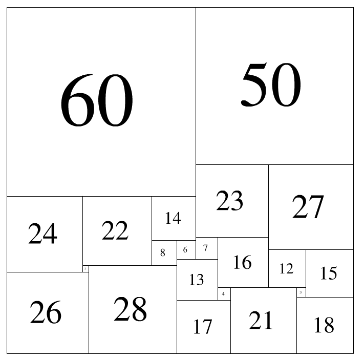

# 第六届蓝桥杯国赛

[<span id = "0">目录</span>](#0) 
1. [积分之迷](#1)
2. [完美正方形](#2)
3. [关联账户](#3)
4. [密文搜索](#4)


[<span id = "1">1. 积分之迷</span>](#0) 

小明开了个网上商店，卖风铃。共有3个品牌：A，B，C。
为了促销，每件商品都会返固定的积分。

小明开业第一天收到了三笔订单：
第一笔：3个A + 7个B + 1个C，共返积分：315
第二笔：4个A + 10个B + 1个C，共返积分：420
第三笔：A + B + C，共返积分....

你能算出第三笔订单需要返积分多少吗？

请提交该整数，不要填写任何多余的内容。

```
#include <iostream>
using namespace std;

int main(){
	for(int i = 0; i <= 500; i++)
		for(int j = 0; j <= 500; j++)
			for(int k = 0; k <= 500; k++){
				if(3 * i + 7 * j + k == 315 && 4 * i + 10 * j + k == 420){
					cout << i + j + k << endl;
					return 0;
				}
			}
    return 0;
}
```

[<span id = "2">2. 完美正方形</span>](#0) 

如果一些边长互不相同的正方形，可以恰好拼出一个更大的正方形，则称其为完美正方形。

历史上，人们花了很久才找到了若干完美正方形。比如：如下边长的22个正方形
2 3 4 6 7 8 12 13 14 15 16 17 18 21 22 23 24 26 27 28 50 60
如那样组合，就是一种解法。此时，
紧贴上边沿的是：60 50
紧贴下边沿的是：26 28 17 21 18

22阶完美正方形一共有8种。下面的组合是另一种：
2 5 9 11 16 17 19 21 22 24 26 30 31 33 35 36 41 46 47 50 52 61
如果告诉你该方案紧贴着上边沿的是从左到右依次为：47 46 61，
你能计算出紧贴着下边沿的是哪几个正方形吗？

请提交紧贴着下边沿的正方形的边长，从左到右，用空格分开。

不要填写任何多余的内容或说明文字。

[<span id = "3">3. 关联账户</span>](#0) 

为增大反腐力度，某地警方专门支队，对若干银行账户展开调查。

如果两个账户间发生过转账，则认为有关联。如果a,b间有关联, b,c间有关联，则认为a,c间也有关联。

对于调查范围内的n个账户（编号0到n-1），警方已知道m条因转账引起的直接关联。

现在希望知道任意给定的两个账户，求出它们间是否有关联。有关联的输出1，没有关联输出0

小明给出了如下的解决方案：

```
#include <stdio.h>
#define N 100

int connected(int* m, int p, int q)
{
	return m[p]==m[q]? 1 : 0;
}

void link(int* m, int p, int q)
{
	int i;
	if(connected(m,p,q)) return;
	int pID = m[p];
	int qID = m[q];
	for(i=0; i<N; i++) _____________________________________;  //填空位置
}

int main()
{
	int m[N];
	int i;
	for(i=0; i<N; i++) m[i] = i; //初始状态，每个节点自成一个连通域
	link(m,0,1); //添加两个账户间的转账关联
	link(m,1,2);
	link(m,3,4);
	link(m,5,6);
	link(m,6,7);
	link(m,8,9);
	link(m,3,7);

	printf("%d ", connected(m,4,7));
	printf("%d ", connected(m,4,5));
	printf("%d ", connected(m,7,9));
	printf("%d ", connected(m,9,2));
	return 0;
}
```

请分析源代码，并提交划线部分缺少的代码。不要填写已有代码或任何多余内容。

答案: m[i] = m[i] == qID ? pID : m[i]

---

[<span id = "4">4. 密文搜索</span>](#0) 

福尔摩斯从X星收到一份资料，全部是小写字母组成。
他的助手提供了另一份资料：许多长度为8的密码列表。
福尔摩斯发现，这些密码是被打乱后隐藏在先前那份资料中的。

请你编写一个程序，从第一份资料中搜索可能隐藏密码的位置。要考虑密码的所有排列可能性。

数据格式：

输入第一行：一个字符串s，全部由小写字母组成，长度小于1024*1024
紧接着一行是一个整数n,表示以下有n行密码，1<=n<=1000
紧接着是n行字符串，都是小写字母组成，长度都为8

要求输出：
一个整数, 表示每行密码的所有排列在s中匹配次数的总和。

例如：
用户输入：
aaaabbbbaabbcccc
2
aaaabbbb
abcabccc

则程序应该输出：
4

这是因为：第一个密码匹配了3次，第二个密码匹配了1次，一共4次。


资源约定：
峰值内存消耗 < 512M
CPU消耗  < 3000ms


[<span id = "5">5. 居民集会</span>](#0) 

蓝桥村的居民都生活在一条公路的边上，公路的长度为L，每户家庭的位置都用这户家庭到公路的起点的距离来计算，第i户家庭距起点的距离为di。

每年，蓝桥村都要举行一次集会。今年，由于村里的人口太多，村委会决定要在4个地方举行集会，其中3个位于公路中间，1个位于公路的终点。

已知每户家庭都会向着远离公路起点的方向去参加集会，参加集会的路程开销为家庭内的人数ti与距离的乘积。

给定每户家庭的位置di和人数ti，请为村委会寻找最好的集会举办地：p1, p2, p3, p4 (p1<=p2<=p3<=p4=L),使得村内所有人的路程开销和最小。

【输入格式】
输入的第一行包含两个整数n, L，分别表示蓝桥村的家庭数和公路长度。
接下来n行，每行两个整数di, ti，分别表示第i户家庭距离公路起点的距离和家庭中的人数。

【输出格式】
输出一行，包含一个整数，表示村内所有人路程的开销和。
【样例输入】
6 10
1 3
2 2
4 5
5 20
6 5
8 7
【样例输出】
18
【样例说明】
在距起点2, 5, 8, 10这4个地方集会，6个家庭需要的走的距离分别为1, 0, 1, 0, 2, 0，总的路程开销为1*3+0*2+1*5+0*20+2*5+0*7=18。

【数据规模与约定】
对于10%的评测数据，1<=n<=300。
对于30%的评测数据，1<=n<=2000，1<=L<=10000，0<=di<=L，di<=di+1，0<=ti<=20。
对于100%的评测数据，1<=n<=100000，1<=L<=1000000，0<=di<=L，di<=di+1，0<=ti<=1000000。


资源约定：
峰值内存消耗 < 512M
CPU消耗  < 5000ms


[<span id = "6"></span>](#0) 

标题：模型染色

在电影《超能陆战队》中，小宏可以使用他的微型机器人组合成各种各样的形状。
现在他用他的微型机器人拼成了一个大玩具给小朋友们玩。为了更加美观，他决定给玩具染色。

小宏的玩具由n个球型的端点和m段连接这些端点之间的边组成。下图给出了一个由5个球型端点和4条边组成的玩具，看上去很像一个分子的球棍模型。

由于小宏的微型机器人很灵活，这些球型端点可以在空间中任意移动，同时连接相邻两个球型端点的边可以任意的伸缩，这样一个玩具可以变换出不同的形状。在变换的过程中，边不会增加，也不会减少。
小宏想给他的玩具染上不超过k种颜色，这样玩具看上去会不一样。如果通过变换可以使得玩具变成完全相同的颜色模式，则认为是本质相同的染色。现在小宏想知道，可能有多少种本质不同的染色。

【输入格式】
输入的第一行包含三个整数n, m, k，
分别表示小宏的玩具上的端点数、边数和小宏可能使用的颜色数。端点从1到n编号。
接下来m行每行两个整数a, b，表示第a个端点和第b个端点之间有一条边。输入保证不会出现两条相同的边。

【输出格式】
输出一行，表示本质不同的染色的方案数。由于方案数可能很多，请输入方案数除10007的余数。

【样例输入】
3 2 2
1 2
3 2
【样例输出】
6
【样例说明】
令(a, b, c)表示第一个端点染成a，第二个端点染成b，第三个端点染成c，则下面6种本质不同的染色：(1, 1, 1), (1, 1, 2), (1, 2, 1), (1, 2, 2), (2, 1, 2), (2, 2, 2)。
而(2, 1, 1)与(1, 1, 2)是本质相同的，(2, 2, 1)与(2, 1, 2)是本质相同的。

【数据规模与约定】
对于20%的评测数据，1<=n<=5， 1<=k<=2。
对于50%的评测数据，1<=n<=10, 1<=k<=8。
对于100%的评测数据，1<=n<=10, 1<=m<=45, 1<=k<=30。

资源约定：
峰值内存消耗 < 512M
CPU消耗  < 5000ms

